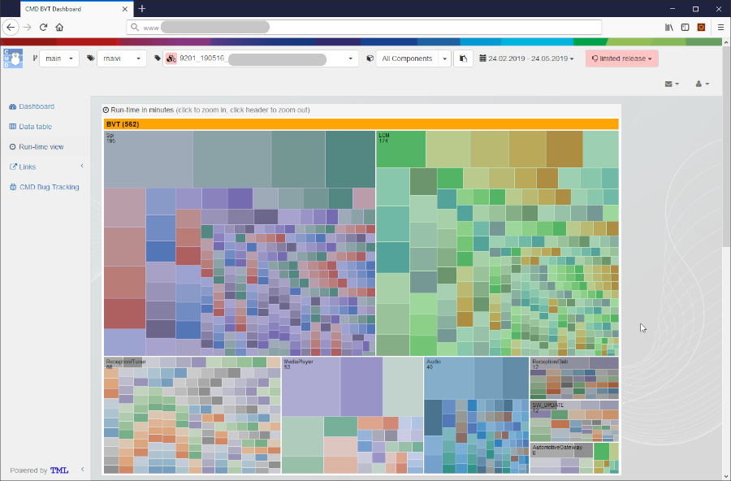

# TestResultWebApp (TRWebApp)

## Table of Contents

-   [Getting Started](#getting-started)
-   [Usage](#usage)
-   [Import data](#import-data)
-   [Contribution](#contribution)
-   [Documentation](#documentation)
-   [Feedback](#feedback)
-   [About](#about)
    -   [Maintainers](#maintainers)
    -   [Contributors](#contributors)
    -   [License](#license)

## Getting Started

[TRWebApp](https://github.com/test-fullautomation/testresultwebapp) is a
generic web based open source application which allows processing and
displaying of test result data in a sophisticated way.

[TRWebApp](https://github.com/test-fullautomation/testresultwebapp) uses
a mysql data base, Node,js on server side and JavaScript on Web-Browser
side.

[TRWebApp](https://github.com/test-fullautomation/testresultwebapp) was
initially implemented at

[Robert Bosch Car
Multimedia](https://www.bosch.de/unser-unternehmen/bosch-in-deutschland/hildesheim)
and was open sourced in 2020.

To understand more detail about the WebApp\'s features, the chart\'s
meanings, the displayed information on each view, please refer to
[TRWebApp's
Documentation](https://github.com/test-fullautomation/testresultwebapp/blob/develop/TestResultWebApp/TestResultWebApp.pdf).

## Usage

[TRWebApp](https://github.com/test-fullautomation/testresultwebapp) has
a main menu (on the top) which allows you to:

-   select the branch, variant, version or component for
    views/comparison.
-   select the range of time for displaying test results in charts.
-   set the test result to appropriate state such as **released** or
    **died**.

[TRWebApp](https://github.com/test-fullautomation/testresultwebapp)
provides 4 main views which will give from the overview of the test
execution result to the detail of the single test results.

Besides, you can have a comparisons with the previous test results or
related test results (different variants).

### Dashboard view

The Dashboard shows an overview of the test execution result, such as:

-   Total test cases.
-   Passed rate.
-   Duration of test execution.
-   The execution time.
-   The test user.
-   The test machine.
-   \...

There are also some charts which help you to get the the overview
analysis about the test result, components\'s status or even the
comparison to the previous test execution results.

### Datatable view

The data table shows all executed test case and their results ordered by
components names. Besides, it also allows to:

-   browse into the detail of single test results.
-   open the traceback for failed test cases.
-   collaborate with your team by leaving your comment.
-   filter test cases.
-   search test cases.

### Run-time view

The run-time view shows you test cases grouped by component. The size of
a block is relative for the run-time of a test case. This allows you to
optimize the run-time of a your test suite.

### Diff view

The diff view is very powerful. It shows you very fast the differences
of test runs from different test suites. For this a spiral view is used
where the center is the start of the test suite execution.

The diff view allows you to:

-   show the differences of current test results to the previous and the
    next ones.

-   select any test results for comparison (up to 5 test results)

-   filter test cases to be displayed in the sprial line:

    > -   show only test cases which are other than passed, inclusive
    >     new and missing test cases (default).
    > -   show only test cases which are failed.
    > -   show only test cases which are new or missing.

-   open the traceback for failed test cases by clicken the bid dot.

## Import data

The data base model is generic and allows to process any test result
data. Currently we provide an import tool for:

-   [Robot Framework](http://robotframework.org) test result files.
    Please refer to
    [RobotLog2DB](https://github.com/test-fullautomation/robotframework-robotlog2db).

## Contribution

We are always searching support and you are cordially invited to help to
improve
[TRWebApp](https://github.com/test-fullautomation/testresultwebapp)
tool. Please contact [Thomas
Pollerspöck](mailto:Thomas.Pollerspoeck@de.bosch.com) if you want to
contribute.

## Documentation

To understand more detail about the WebApp\'s features, the chart\'s
meanings, the displayed information on each view, please refer to
[TRWebApp's
Documentation](https://github.com/test-fullautomation/testresultwebapp/blob/develop/TestResultWebApp/TestResultWebApp.pdf).

## Feedback

Please feel free to give any feedback to us via

Email to: [Robot Framework Support
Group](mailto:hi_cm-ci1_robotframeworksupportgroup@bcn.bosch.com)

Issue tracking: [TRWebApp
Issues](https://github.com/test-fullautomation/testresultwebapp/issues)

## About

### Maintainers

[Thomas Pollerspöck](mailto:Thomas.Pollerspoeck@de.bosch.com)

[Tran Duy Ngoan](mailto:Ngoan.TranDuy@vn.bosch.com)

### Contributors

[Nguyen Huynh Tri Cuong](mailto:Cuong.NguyenHuynhTri@vn.bosch.com)

[Mai Dinh Nam Son](mailto:Son.MaiDinhNam@vn.bosch.com)

[Tran Hoang Nguyen](mailto:Nguyen.TranHoang@vn.bosch.com)

[Holger Queckenstedt](mailto:Holger.Queckenstedt@de.bosch.com)

### License

Copyright 2020-2022 Robert Bosch GmbH

Licensed under the Apache License, Version 2.0 (the \"License\"); you
may not use this file except in compliance with the License. You may
obtain a copy of the License at

> 

Unless required by applicable law or agreed to in writing, software
distributed under the License is distributed on an \"AS IS\" BASIS,
WITHOUT WARRANTIES OR CONDITIONS OF ANY KIND, either express or implied.
See the License for the specific language governing permissions and
limitations under the License.
