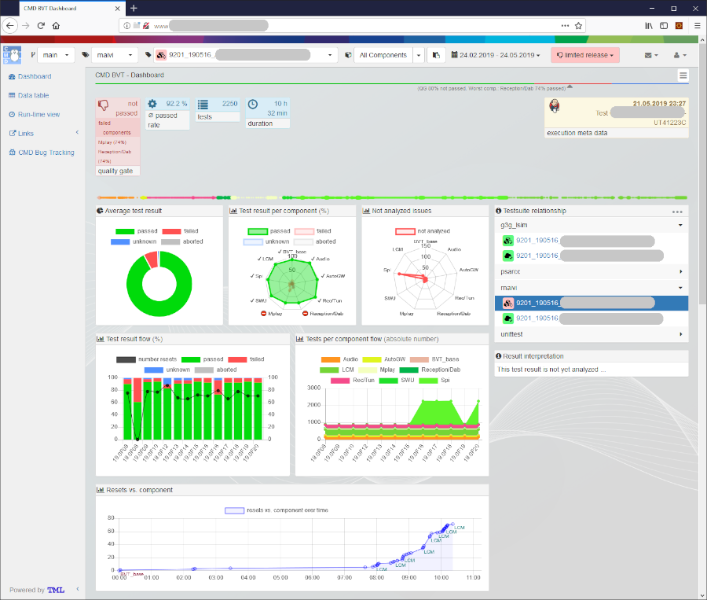
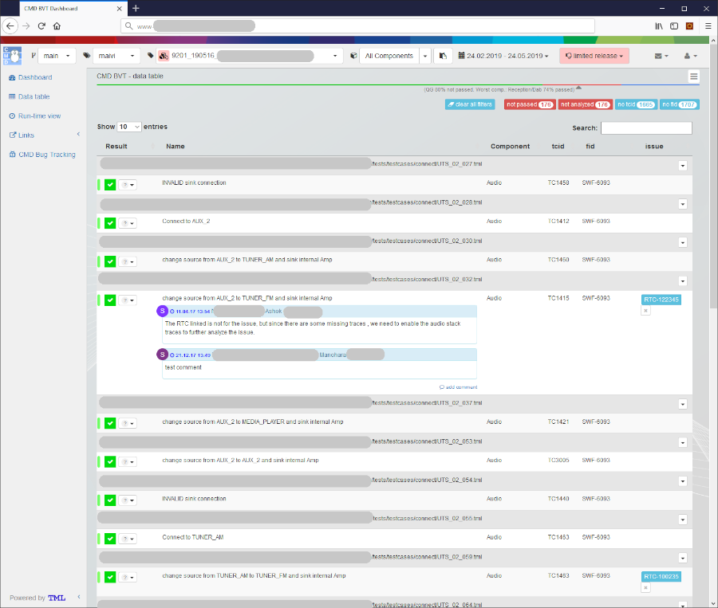
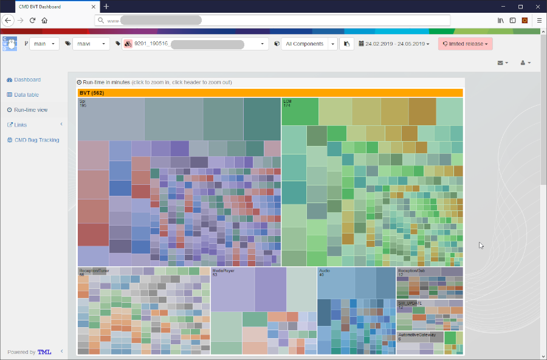
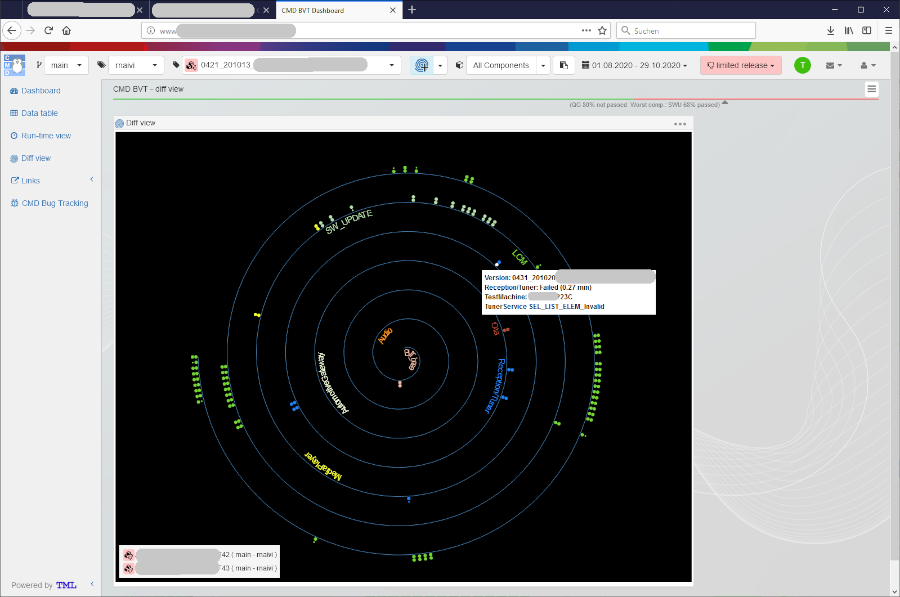

.. Copyright 2020-2022 Robert Bosch GmbH

   Licensed under the Apache License, Version 2.0 (the "License");
   you may not use this file except in compliance with the License.
   You may obtain a copy of the License at

   http://www.apache.org/licenses/LICENSE-2.0

   Unless required by applicable law or agreed to in writing, software
   distributed under the License is distributed on an "AS IS" BASIS,
   WITHOUT WARRANTIES OR CONDITIONS OF ANY KIND, either express or implied.
   See the License for the specific language governing permissions and
   limitations under the License.

TestResultWebApp (TRWebApp)
===========================

Table of Contents
-----------------

-  `Getting Started <#getting-started>`__

   -  `How to install <#how-to-install>`__
-  `Usage <#usage>`__
-  `Contribution <#contribution>`__
-  `Sourcecode Documentation <#documentation>`__
-  `Feedback <#feedback>`__
-  `About <#about>`__

   -  `Maintainers <#maintainers>`__
   -  `Contributors <#contributors>`__
   -  `License <#license>`__

Getting Started
---------------

TRWebApp_ is a generic web based open source application which allows processing 
displaying of test result data in a sophisticated way.

TRWebApp_ uses a mysql data base, nodejs on server side and JavaScript on
Web-Browser side.

TRWebApp_ was initially implemented at |IMG_BOSCH| 
`Robert Bosch Car Multimedia`_ and was open sourced in 2020. 

How to install
~~~~~~~~~~~~~~

Usage
-----

TRWebApp_ has the main menu (on the top) which allow you to:

- select the branch, variant, version or component for views/comparison.
- select the range of time for displaying test results in charts.
- set the test result to appropriate state such as **released** or **died**.

TRWebApp_ provides 4 main views which will give from the overview of the test
execution result to the detail of the single test results.

Besides, you can have the comparison to the previous test results or 
related test results (different variants).

Dashboard
~~~~~~~~~

The Dashboard shows an overview of the test execution result, such as:

- Total test cases.
- Passed rate.
- Duration of test execution.
- The execution time.
- The test user
- The test machine
- ...

There are also some charts which help you to get the the overview analysis about
the test result, components's status or even the comparison to the previous test
execution results.

|IMG_WEBAPP_DASHBOARD|

Data table
~~~~~~~~~~

The data table show all executed test case and their results order by 
component's name. Besides, it also allows to:

- browse into the detail of single test results. 
- open the traceback for failed test cases.
- collaborate with your team by leaving your comment.
- filter test cases.
- search test cases.
   
|IMG_WEBAPP_DATATABLE|

Run-time view
~~~~~~~~~~~~~

The run-time view shows you test cases grouped by compnent. 
The size of a block is relative for the run-time of a test case. 
This allows you to optimize the run-time of a your test suite.

|IMG_WEBAPP_RUNTIME|

Diff view
~~~~~~~~~

The diff view allows you to diff test runs from different test suites.
For this a spiral view is used where the center is the start of the test suite 
execution.

The diff view allows you to:

- show only test cases which are other than passed.
- show only test cases which are failed.
- show only test cases which are new or missing.
- open the traceback for failed test cases.
- diff up to 5 versions.
   
|IMG_WEBAPP_DIFFVIEW|      

Contribution
------------
We are always searching support and you are cordially invited to help to improve 
TRWebApp_ tool.

Documentation
-------------
To understand more detail about the WebApp's features, the chart's meanings, 
the displayed information on each view, please refer to 
`TRWebApp’s Documentation`_.

Feedback
--------
Please feel free to give any feedback to us via

Email to: `Robot Framework Support Group`_

Issue tracking: `TRWebApp Issues`_

About
-----

Maintainers
~~~~~~~~~~~
`Thomas Pollerspöck`_

`Tran Duy Ngoan`_

Contributors
~~~~~~~~~~~~

`Nguyen Huynh Tri Cuong`_

`Mai Dinh Nam Son`_

`Tran Hoang Nguyen`_

`Holger Queckenstedt`_

License
~~~~~~~

Copyright 2020-2022 Robert Bosch GmbH

Licensed under the Apache License, Version 2.0 (the "License");
you may not use this file except in compliance with the License.
You may obtain a copy of the License at

    |License: Apache v2|

Unless required by applicable law or agreed to in writing, software
distributed under the License is distributed on an "AS IS" BASIS,
WITHOUT WARRANTIES OR CONDITIONS OF ANY KIND, either express or implied.
See the License for the specific language governing permissions and
limitations under the License.

.. _TRWebApp: 
      https://github.com/test-fullautomation/testresultwebapp
.. _Robot Framework Support Group: 
      mailto:RobotFrameworkSupportGroup@bcn.bosch.com
.. _TRWebApp Issues: 
      https://github.com/test-fullautomation/testresultwebapp/issues
.. _Robert Bosch Car Multimedia: 
      https://www.bosch.de/unser-unternehmen/bosch-in-deutschland/hildesheim/
.. _TRWebApp’s Documentation: 
      https://github.com/test-fullautomation/testresultwebapp/blob/develop/
      TestResultWebApp/TestResultWebApp.pdf
.. _Thomas Pollerspöck: mailto:Thomas.Pollerspoeck@de.bosch.com
.. _Tran Duy Ngoan: mailto:Ngoan.TranDuy@vn.bosch.com
.. _Nguyen Huynh Tri Cuong: mailto:Cuong.NguyenHuynhTri@vn.bosch.com
.. _Mai Dinh Nam Son: mailto:Son.MaiDinhNam@vn.bosch.com
.. _Tran Hoang Nguyen: mailto:Nguyen.TranHoang@vn.bosch.com
.. _Holger Queckenstedt: mailto:Holger.Queckenstedt@de.bosch.com
.. |License: Apache v2| image:: https://img.shields.io/pypi/l/robotframework.svg
   :target: http://www.apache.org/licenses/LICENSE-2.0.html
.. |IMG_BOSCH| image:: 
      https://upload.wikimedia.org/wikipedia/de/thumb/3/31/Bosch-logotype.svg/
      200px-Boschlogotype.svg.png
      :height: 25

