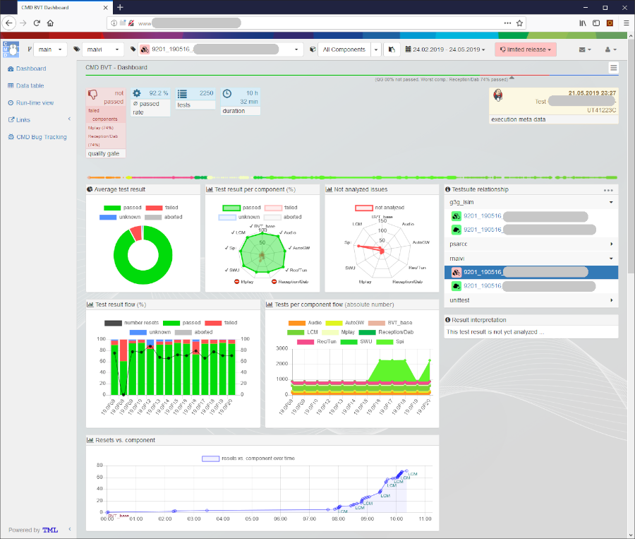
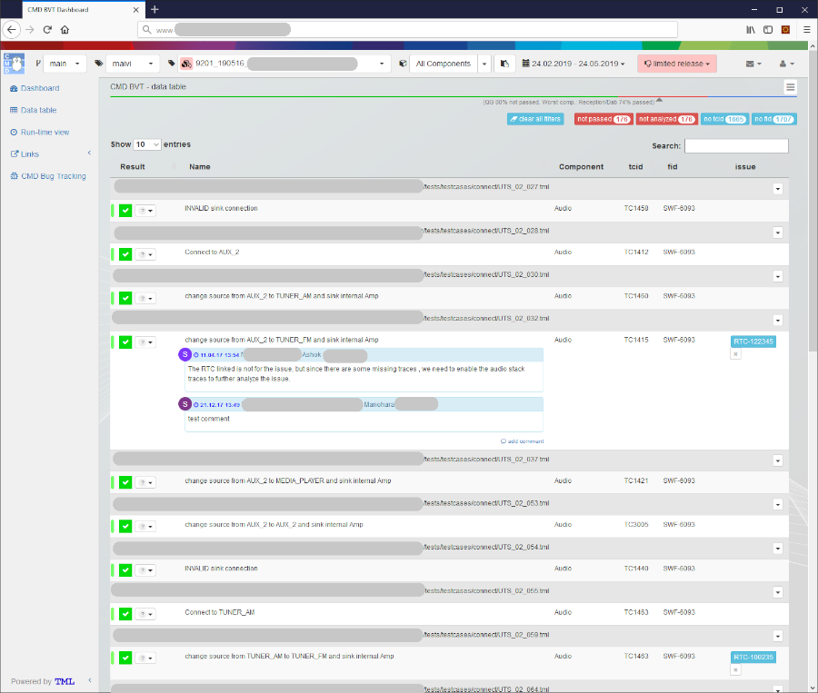

.. Copyright 2020-2022 Robert Bosch GmbH

.. Licensed under the Apache License, Version 2.0 (the "License");
   you may not use this file except in compliance with the License.
   You may obtain a copy of the License at

.. http://www.apache.org/licenses/LICENSE-2.0

.. Unless required by applicable law or agreed to in writing, software
   distributed under the License is distributed on an "AS IS" BASIS,
   WITHOUT WARRANTIES OR CONDITIONS OF ANY KIND, either express or implied.
   See the License for the specific language governing permissions and
   limitations under the License.

This package provides a generic web based open source application which allows processing displaying of test result data in a sophisticated way.

**TO BE CONTINUED**

(Place the content of

HowTo_curl_test_TODO_convertto_rst.txt and

HowTo_NewWebApp_instance_TODO_convertto_rst.txt here)

Impressions
-----------

.. image:: ./pictures/DiffView.png

.. image:: ./pictures/Runtime.png

